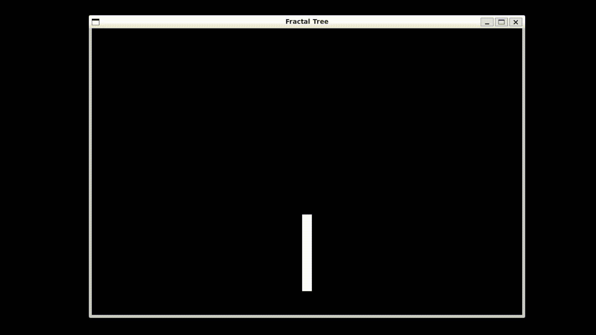

# Fractal Tree
&emsp; &emsp; &emsp; &emsp; &emsp; &emsp; &emsp; &emsp; &emsp; &emsp; &emsp;


## Table of Contents
- [Fractal Tree Simulation](#fractal-tree-simulation)
- [Controls](#controls)
- [Compilation and Running](#compilation-and-running)
- [Dependencies](#dependencies)
- [Dependency Installation](#dependency-installation)
- [References](#references)
- [License](#license)

## Fractal Tree Simulation
A simulation of a Fractal Tree written using the C programming language with Raylib as the graphics and keyboard handler

## Controls
* Space - Pause / Resume Simulation
* R - Reset Simulation
* ESC - Quit

## Compilation and Running

```sh
make
./fractal_tree
```

## Dependencies
* Raylib
* gcc
* make
* git
* ALSA
* MESA
* X11

## Dependency Installation
* Debian Linux Distributions (e.g. Ubuntu):

```sh
sudo apt install build-essential git
sudo apt install libasound2-dev libx11-dev libxrandr-dev libxi-dev libgl1-mesa-dev libglu1-mesa-dev libxcursor-dev libxinerama-dev libwayland-dev libxkbcommon-dev
```

Then follow the raylib build instructions at: https://github.com/raysan5/raylib/wiki/Working-on-GNU-Linux#building-library-manually

The raylib build instructions are typically something like:

```sh
git clone https://github.com/raysan5/raylib.git
cd raylib
mkdir build
cd build
cmake ..
make
sudo make install
```

## References
- [Fractal Tree Wiki](https://en.wikipedia.org/wiki/Fractal_canopy)

## License
Eliseo Copyright 2026
<br>
Code released under the [MIT License](LICENSE)
